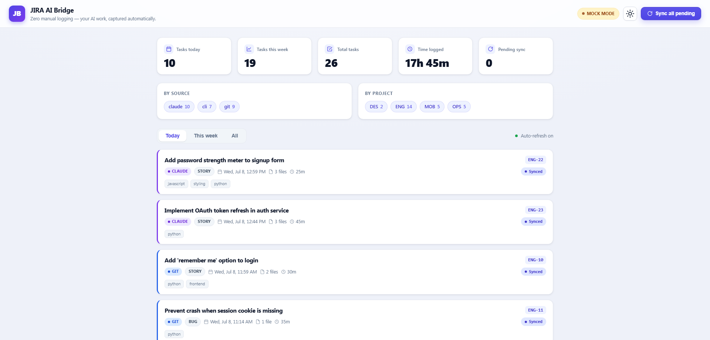
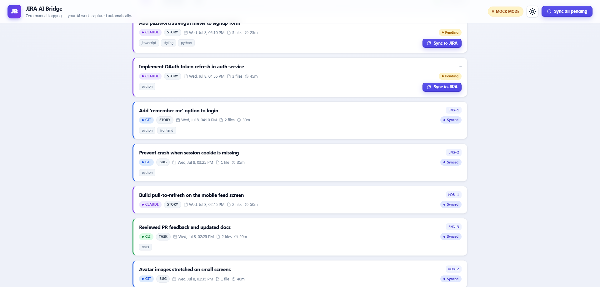
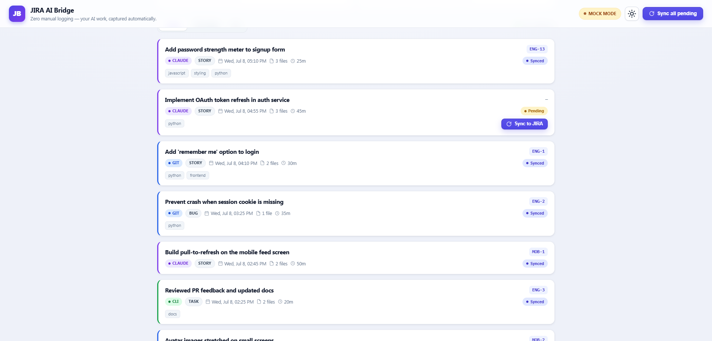

# JIRA AI Bridge

> **Stop logging your work twice.** JIRA AI Bridge watches your AI-assisted dev
> activity (git commits, Claude Code sessions, manual notes), creates + logs the
> JIRA tasks for you, and shows a dashboard of *"what I did today / this week."*

The elevated version of the CodeAlpha **Task Automation** task — it automates the
most tedious chore in AI-assisted development: **manual JIRA bookkeeping**. Runs
fully offline against a local mock JIRA when no credentials are configured.

> 📖 **Developer documentation** (architecture, watchers, install, dashboard,
> REST API, real-JIRA setup, config reference, testing) lives in
> **[`docs/README.md`](docs/README.md)**.

---

## 🎬 Demo Video

A short walkthrough of the dashboard — summary stats, the work timeline, and
one-click **Sync to JIRA**. Click the poster to play
[`docs/demo.mp4`](docs/demo.mp4):

[](docs/demo.mp4)

---

## 📸 Screenshots

### Dashboard overview

Summary stats (tasks today / this week / total, time logged, pending sync),
**by-source** and **by-project** breakdowns, MOCK/real mode, and dark-mode toggle.


### Work timeline

Each captured work event as a card: title, **source badge** (git / claude / cli),
inferred **issue type** (Story / Bug / Task), files changed, time, JIRA key, and
status.



### One-click sync

Pending events show a **Sync to JIRA** button; syncing assigns a key
(e.g. `ENG-22`) and flips the status to **synced** (toast confirmation shown).



---

## 📁 Project Structure

```
jira_ai_bridge/
├─ src/jira_bridge/
│  ├─ core.py            # WorkEvent + BridgeEngine (persist, dedup, infer, sync)
│  ├─ jira_client.py     # JiraClient ABC, RealJiraClient, MockJiraClient, get_client()
│  ├─ config.py          # .env loading + Settings
│  ├─ report.py          # text "what I did" reports
│  ├─ cli.py             # argparse CLI
│  ├─ __main__.py        # python -m jira_bridge
│  ├─ watchers/
│  │  ├─ base.py         # BaseWatcher interface
│  │  ├─ git_watcher.py  # polls git log / status
│  │  ├─ claude_hook.py  # reads Claude Code hook payload from stdin
│  │  └─ cli_watcher.py  # manual one-shot trigger
│  └─ web/
│     ├─ app.py          # Flask app factory + JSON API
│     ├─ templates/dashboard.html
│     └─ static/style.css, app.js
├─ tests/                # pytest suite (no network / git required)
├─ docs/                 # screenshots, demo video + developer docs
├─ demo_seed.py          # seed ~12 sample events for an instant great demo
├─ requirements.txt
├─ pyproject.toml
└─ .env.example
```
